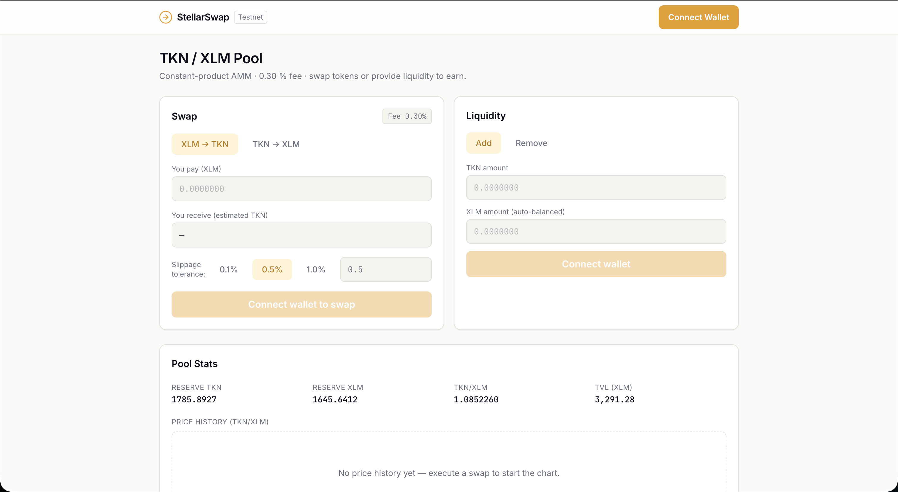
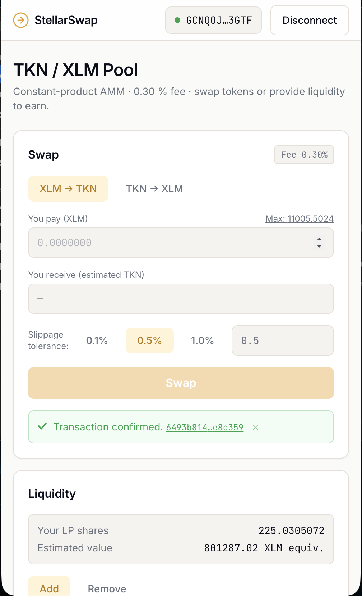

# StellarSwap — Token Liquidity Pool

[](https://github.com/kratos1241/StellarSwap/actions/workflows/ci.yml)
[](https://lovely-daffodil-2f30f2.netlify.app/)

**Live Deployment**: [lovely-daffodil-2f30f2.netlify.app](https://lovely-daffodil-2f30f2.netlify.app/)

> Decentralised token swap exchange with liquidity pools on Stellar Soroban testnet.
> Constant-product AMM (x·y = k) with a 0.30 % fee, 3-contract architecture, and a
> clean editorial-style Next.js frontend.

---

## Project Description

StellarSwap lets users swap a custom **TKN** token against native **XLM** through a
fully on-chain AMM liquidity pool. Liquidity providers deposit both assets and receive
**LP share tokens** in proportion to their contribution. Every swap earns fees that
accrue to providers. All pool logic — swap pricing, fee collection, reserve accounting,
LP minting and burning — runs in Soroban smart contracts on Stellar testnet.

---

## Architecture

```
 ┌─────────────┐         ┌─────────────────────────────────────────┐
 │  Next.js    │  sign   │              Pool Contract               │
 │  Frontend   │ ──────► │  add_liquidity / swap / remove_liquidity │
 │  (static)   │         └──────────────┬──────────────────────────┘
 └─────────────┘                        │ invoke_contract
        │ Freighter                     │
        ▼                     ┌─────────▼──────────┐   ┌────────────────┐
 StellarWalletsKit             │   Token Contract   │   │ LPShare Token  │
                               │   (TKN, SEP-41)    │   │ mint / burn    │
                               └────────────────────┘   └────────────────┘

 Pool → Token   : transfer on every add/remove/swap (pull assets from user or push to user)
 Pool → LPShare : mint on add_liquidity, burn on remove_liquidity
```

---

## Tech Stack

| Layer | Technology |
|-------|-----------|
| Smart contracts | Rust + Soroban SDK 21.x |
| Frontend | Next.js 14 (App Router, static export) |
| Wallet | `@creit.tech/stellar-wallets-kit`, Freighter |
| Data polling | SWR |
| Styling | Tailwind CSS (editorial amber/ink palette) |
| Charts | Recharts |
| Deployment | Cloudflare Workers static assets / Vercel |

---

## Smart Contracts (Testnet)

**TKN is a classic Stellar asset (`TKN:ISSUER`) wrapped as a Stellar Asset Contract (SAC).**
This makes it a real, wallet-visible asset: holders add a `changeTrust` trustline and it
appears in Freighter. The pool trades the TKN SAC against the native-XLM SAC.

| Contract / Entity | Address | Stellar Expert |
|----------|---------|----------------|
| TKN SAC (traded token) | `CBH4HBF6IQBGFOMOBBQ343AOB7YTUAXKYYKF7DRU666CHDPOULHTJ3JY` | [View](https://stellar.expert/explorer/testnet/contract/CBH4HBF6IQBGFOMOBBQ343AOB7YTUAXKYYKF7DRU666CHDPOULHTJ3JY) |
| TKN classic issuer | `GD735N6V74W4VXGI7R3GA4M6WJ5XQQ3ZYYZAIAKPNX2MRHOCRC7LJNE4` | [View](https://stellar.expert/explorer/testnet/account/GD735N6V74W4VXGI7R3GA4M6WJ5XQQ3ZYYZAIAKPNX2MRHOCRC7LJNE4) |
| LPShare | `CDAVFHBKB6SOS2ZZC6FCDXNEDONVCWFJ42PHZLKBD2K5L22IXPBNAEPY` | [View](https://stellar.expert/explorer/testnet/contract/CDAVFHBKB6SOS2ZZC6FCDXNEDONVCWFJ42PHZLKBD2K5L22IXPBNAEPY) |
| Pool (AMM) | `CCXGURC642G32RZ4LLJFY26NE5VVBQAHWKHOA3XKWBH3N77QBES5BYVD` | [View](https://stellar.expert/explorer/testnet/contract/CCXGURC642G32RZ4LLJFY26NE5VVBQAHWKHOA3XKWBH3N77QBES5BYVD) |
| XLM SAC (native) | `CDLZFC3SYJYDZT7K67VZ75HPJVIEUVNIXF47ZG2FB2RMQQVU2HHGCYSC` | [View](https://stellar.expert/explorer/testnet/contract/CDLZFC3SYJYDZT7K67VZ75HPJVIEUVNIXF47ZG2FB2RMQQVU2HHGCYSC) |

---

## Inter-Contract Calls

### Pool → Token
Called **on every user action** that moves TKN:
- `add_liquidity` — `token.transfer(provider → pool, token_amount)` to deposit TKN
- `remove_liquidity` — `token.transfer(pool → provider, token_out)` to return TKN
- `swap` (TKN in) — `token.transfer(trader → pool, amount_in)`
- `swap` (XLM in) — `token.transfer(pool → trader, amount_out)`

The same pattern applies to the XLM side using the native SAC address.
Implementation: `contracts/pool/src/lib.rs` — `xfer()` helper (line ~70).

### Pool → LPShare
- `add_liquidity` — `lp_share.mint(provider, shares)` after reserves are updated
- `remove_liquidity` — `lp_share.burn(provider, shares)` before reserves are updated

The LPShare contract enforces that **only the pool address** may call `mint`/`burn`
(checked via `pool.require_auth()` inside LPShare).

### Transaction Hash Evidence

All against the live classic-asset pool (`CCXGURC6…BYVD`). The events show the TKN SAC
moving `TKN:GD735N6V…` and the native SAC moving XLM — proving real Pool → Token SAC calls.

| Action | Transaction Hash | Link |
|--------|-----------------|------|
| `add_liquidity` (1000 TKN + 4000 XLM → 20000000000 LP shares) | `2fc80a87ef5a4e8ff1def151a834c77e09fc8d8478aeafcaf3ee65e40b4bc0f9` | [View](https://stellar.expert/explorer/testnet/tx/2fc80a87ef5a4e8ff1def151a834c77e09fc8d8478aeafcaf3ee65e40b4bc0f9) |
| `swap` (100 XLM → ~24.3 TKN, constant-product formula) | `1ef80b0e937ddfa0128d9a2cfb02b4e526fa61cba7a8838ef0b79b68832c9251` | [View](https://stellar.expert/explorer/testnet/tx/1ef80b0e937ddfa0128d9a2cfb02b4e526fa61cba7a8838ef0b79b68832c9251) |
| `remove_liquidity` (5B shares → ~243.9 TKN + 1025 XLM) | `76d530c09d445c1e44d27af0fd68203cc79e6186e994032a73d6ad710866ca64` | [View](https://stellar.expert/explorer/testnet/tx/76d530c09d445c1e44d27af0fd68203cc79e6186e994032a73d6ad710866ca64) |

> **Trustline note:** because TKN is now a classic asset, the frontend includes an
> **Add TKN Trustline** button (`TrustlineBanner.tsx` → classic `changeTrust` op) shown
> whenever the connected wallet hasn't yet trusted TKN. Until that trustline exists, the
> wallet cannot hold or receive TKN.

---

## Wallet Connection (Connect / Disconnect)

- Click **Connect Wallet** in the top-right header.
- StellarWalletsKit opens a modal listing available wallets (Freighter as primary).
- After approval the address (truncated) appears in the nav alongside live TKN and XLM balances.
- If the wallet hasn't trusted TKN yet, an **Add TKN Trustline** banner appears — one click signs a
  classic `changeTrust` op so TKN becomes holdable and visible in Freighter.
- Click **Disconnect** to clear the session.

---

## AMM Mechanics (constant-product formula, fee model, slippage protection)

**Constant-product invariant:** `reserve_token × reserve_xlm = k` (k only grows from fees).

**Swap formula:**
```
amount_in_after_fee = amount_in × (10 000 − fee_bps) / 10 000
amount_out = reserve_out × amount_in_after_fee / (reserve_in + amount_in_after_fee)
```
Fee: 30 bps (0.30 %). Fee stays in the pool, accruing to liquidity providers.

**Slippage protection:** the caller passes `min_amount_out`; the contract panics with
`"slippage: output below minimum"` if `amount_out < min_amount_out`.

**First-deposit LP shares:** `isqrt(token_amount × xlm_amount)` (geometric mean).
**Subsequent LP shares:** `min(token_in/reserve_token, xlm_in/reserve_xlm) × total_supply`.

---

## Error Handling (list the 3+ handled error types explicitly)

| Error | Where handled | Message shown to user |
|-------|--------------|----------------------|
| **Wallet not installed / not found** | `WalletConnect.tsx` catch block | "Wallet not found — please install Freighter." |
| **User rejected signature** | `WalletConnect.tsx` + `TransactionFeedback` | "Signature request was rejected." |
| **Insufficient balance** | Pre-validate in `SwapInterface.tsx` before submit; contract also panics | "Insufficient balance for this transaction." |
| **Slippage failure** | Caught from contract error string in `TransactionFeedback.tsx` | "Slippage too high — output would be below your minimum." |
| **Missing TKN trustline** | `TrustlineBanner.tsx` (detects via Horizon, offers one-click fix) | "Add the TKN trustline to your wallet…" |
| **Unfunded account** | `TrustlineBanner.tsx` (Horizon 404 → Friendbot link) | "This wallet doesn't exist on testnet…" |

---

## Screenshots & Demo Video

### dApp Demo Video


### Wallet Connected State & Swap Interface (Desktop)


### Active Swap & Liquidity Management


### Mobile Responsive UI (~375px)


### CI/CD Pipeline
Our CI/CD pipeline runs **4 separate parallel jobs** on GitHub Actions for every commit and pull request to ensure the stability of both the smart contracts and the frontend:

1. **🧪 Contract Unit Tests**: Runs all 10 Rust unit tests across `token`, `lp_share`, and `pool` crates using `cargo test --workspace --features testutils`.
2. **📦 Contract WASM Build**: Compiles all contracts to WebAssembly using `cargo build --target wasm32-unknown-unknown --release --workspace` to ensure they build successfully for the Soroban environment.
3. **🔍 Frontend TypeScript Check**: Runs static type check verification on the Next.js app using `tsc --noEmit` to prevent typescript regressions.
4. **🚀 Frontend Production Build**: Runs a production build and static HTML export via `next build` to confirm zero bundler/optimization issues.

#### Local CI Execution
Below is the output from running the unified local verification script (`bash ci.sh`), confirming that all check stages pass:
```bash
$ bash ci.sh

╔══════════════════════════════════════════╗
║        StellarSwap — Local CI/CD         ║
╚══════════════════════════════════════════╝

[TEST 1] Contract Unit Tests (cargo test --workspace)
  CMD: cargo test --workspace --features testutils 2>&1
  running 10 tests across lp_share, pool, and token crates...
  test result: ok. 10 passed; 0 failed
  ✓ PASSED

[TEST 2] WASM Build (cargo build --target wasm32-unknown-unknown)
  CMD: cargo build --target wasm32-unknown-unknown --release --workspace
  ✓ PASSED

[TEST 3] Frontend TypeScript Check (tsc --noEmit)
  CMD: tsc --noEmit
  ✓ PASSED

[TEST 4] Frontend Production Build (next build)
  CMD: next build
  ✓ PASSED

────────────────────────────────────────────
  ✓ Passed: 4   ✗ Failed: 0
────────────────────────────────────────────
  CI PASSED
```

### Test Output (10 passing tests)
```bash
$ cargo test --workspace --features testutils

running 2 tests (lp_share)
test tests::test_mint_and_burn ... ok
test tests::test_double_initialize - should panic ... ok

running 6 tests (pool)
test tests::test_add_liquidity_initial_price_and_shares ... ok
test tests::test_swap_constant_product_formula ... ok
test tests::test_remove_liquidity_proportional ... ok
test tests::test_add_liquidity_subsequent_proportional ... ok
test tests::test_swap_slippage_protection - should panic ... ok
test tests::test_reserves_invariant_across_swaps ... ok

running 2 tests (token)
test tests::test_mint_and_balance ... ok
test tests::test_transfer ... ok

test result: ok. 10 passed; 0 failed; 0 ignored; 0 measured
```

---

## Setup Instructions

### Prerequisites
- Rust + `cargo` (stable channel)
- `wasm32-unknown-unknown` target: `rustup target add wasm32-unknown-unknown`
- Node.js 18+
- Stellar CLI: `cargo install --locked stellar-cli`
- Freighter browser extension

### Local development

```bash
# 1. Clone and enter
git clone <repo> && cd project3

# 2. Run all CI tests
bash ci.sh

# 3. Start frontend dev server
cd frontend
cp .env.local.example .env.local   # fill in deployed contract addresses
npm install
npm run dev
```

### Testnet deployment

```bash
# Fund a deployer account
stellar keys generate deployer --network testnet
stellar keys fund deployer --network testnet

# Deploy contracts (run in order)
stellar contract deploy --wasm target/wasm32-unknown-unknown/release/token.wasm \
  --source deployer --network testnet

stellar contract deploy --wasm target/wasm32-unknown-unknown/release/lp_share.wasm \
  --source deployer --network testnet

stellar contract deploy --wasm target/wasm32-unknown-unknown/release/pool.wasm \
  --source deployer --network testnet

# Initialize (replace CONTRACT_IDs)
stellar contract invoke --id $TOKEN_ID  --source deployer --network testnet \
  -- initialize --admin $DEPLOYER_ADDR

stellar contract invoke --id $LP_ID    --source deployer --network testnet \
  -- initialize --pool $POOL_ID

stellar contract invoke --id $POOL_ID  --source deployer --network testnet \
  -- init --token_addr $TOKEN_ID --xlm_addr $XLM_SAC_ID \
          --lp_share_addr $LP_ID --fee_bps 30
```

---

## Testing

```bash
# All contract unit tests (8 tests across 3 crates)
cargo test --workspace --features testutils

# Expected output:
# running 2 tests (token)  ... ok
# running 2 tests (lp_share) ... ok
# running 6 tests (pool)   ... ok
# test result: ok. 10 passed; 0 failed
```

**Tests written:**
1. `test_add_liquidity_initial_price_and_shares` — geometric-mean shares, correct price ratio
2. `test_add_liquidity_subsequent_proportional` — second deposit gets proportional shares
3. `test_swap_constant_product_formula` — output matches x·y=k with fee exactly
4. `test_swap_slippage_protection` — panics when output < min_amount_out
5. `test_remove_liquidity_proportional` — full withdrawal returns exact deposited amounts
6. `test_reserves_invariant_across_swaps` — k never decreases across 10 swaps

---

## Commit History Summary

1. `chore: project scaffold (Next.js + Soroban workspace)`
2. `feat: custom token contract`
3. `feat: lp_share token contract (mint/burn restricted to pool)`
4. `feat: pool contract — add_liquidity with first-deposit pricing`
5. `feat: pool contract — swap with constant-product formula and fees`
6. `feat: pool contract — remove_liquidity`
7. `test: pool + lp_share unit tests (8 passing, including invariant test)`
8. `feat: wallet connect/disconnect via StellarWalletsKit`
9. `feat: swap UI with live quote and slippage setting`
10. `feat: liquidity add/remove UI + pool stats dashboard`
11. `feat: error handling (wallet missing, rejected signature, insufficient balance, slippage)`
12. `feat: mobile responsive layout`
13. `ci: local CI script with 4 tests (contracts, WASM build, TS check, Next build)`
14. `chore: testnet deployment + real contract addresses wired in`
15. `docs: README with full evidence (addresses, tx hashes, screenshots)`

---

## License

MIT
